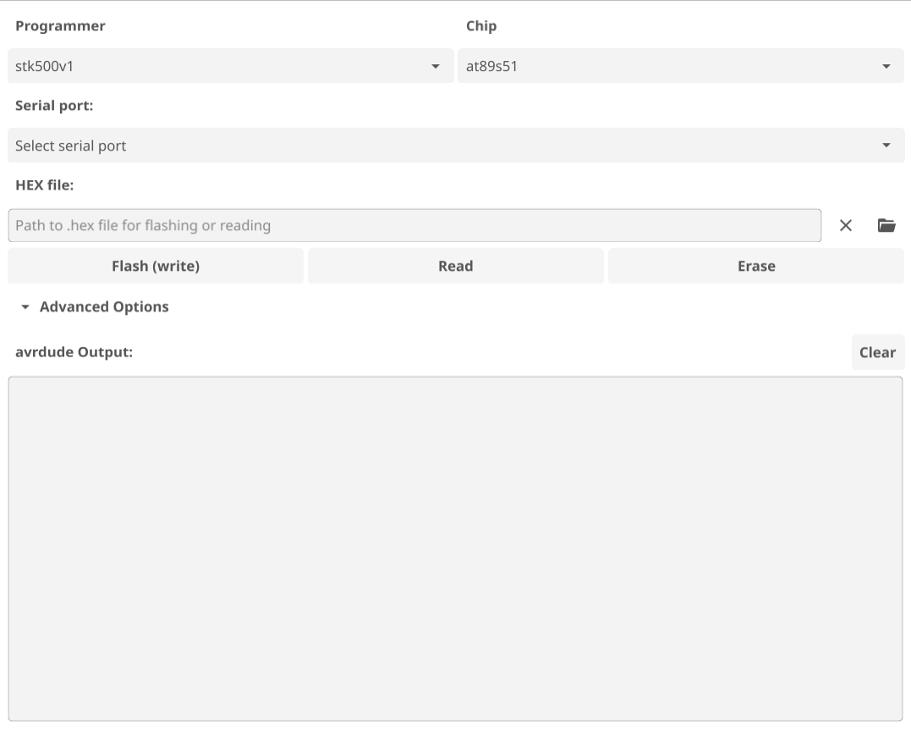
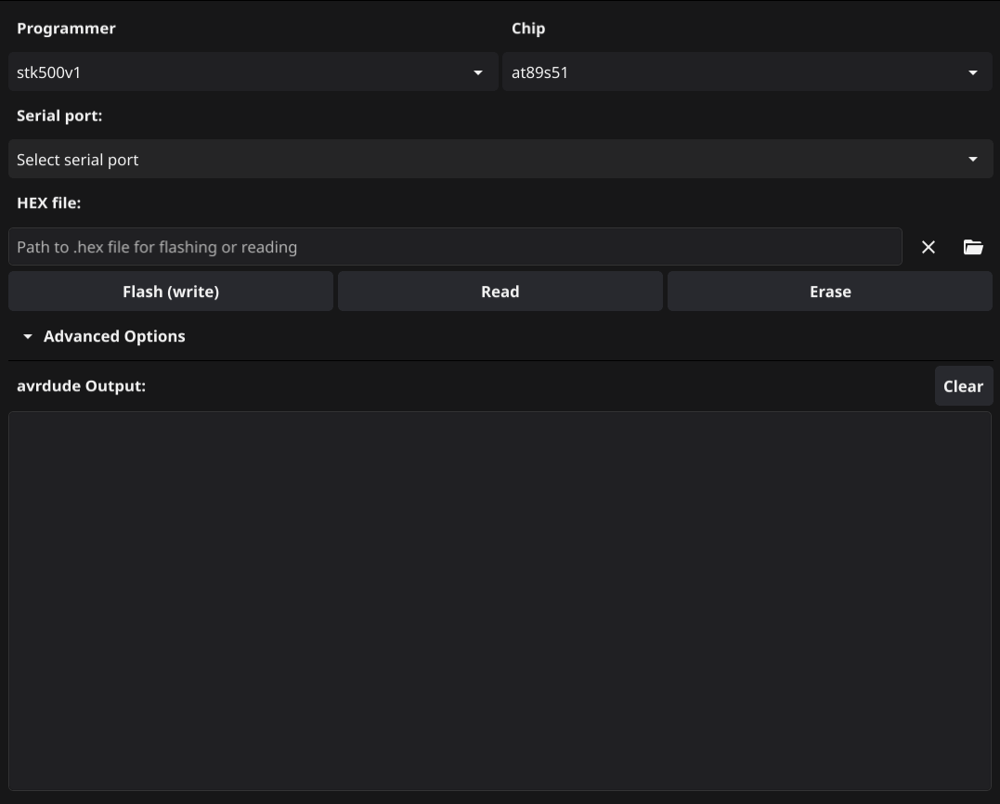

# 8051prog &mdash; A simple GUI programmer for the AT89 series

GUI interface for ISP programming of the at89s5- family of chips with an avr-based programmer(e.g. an Arduino). Functionality includes uploading a hex file, reading or erasing the flash.

	 
	

This is a Fyne Golang desktop application that uses avrdude with a custom configuration to interact with the programmer over serial.

## Usage

### Prepare the programmer

1. Download the Arduino IDE following the instructions at https://docs.arduino.cc/software/ide-v2/tutorials/getting-started/ide-v2-downloading-and-installing/.
2. Connect the board you wish to use as a programmer
3. Open the ArduinoISP example sketch through File>Examples>11.ArduinoISP>ArduinoISPfrom.
4. In the top green bar, select your board from the dropdown.
5. Upload the sketch and wait for the upload to finish.

### Set up 8051prog

1. Download the appropriate binary of this program for your operating system from the GitHub releases page and run it.
2. If not connected already, connect the programmer that you set up in the previous steps through USB to the computer.
3. Select it from the _Serial Port_ dropdown(should be the same as in the Arduino IDE).
4. The _Programmer_ dropdown should alredy be _stk500v1_. Do NOT change this if using an Arduino as a programmer.
5. Select the model of your microcontroller from the _Chip_ dropdown.

### Upload a hex file

1. After following the set up instructions above, select the hex file you wish to upload by either:
   - Dragging and dropping it in this program
   - Browsing and selecting it from the folder icon under _Hex file_ to the right of the text field
   - Manually typing the path to the file in the text field
2. Press the _Upload_ button and wait for the action to finish. **Warning: This will irreversibly erase the previous contents of the chip's memory.**

### Read flash

1. After following the set up instructions above, press the _Read_ button and the memory contents will be displayed in the _Output_. To read to file, look at _Advanced Options_ below.

### Erase flash

1. Press the _Erase_ button and monitor the action's progress in _Output_. **Warning: This will irreversibly wipe the chip's memory.**

### Advanced Options

**Only for knowledgeable/advanced users. Use at your own risk. Actions could be irreversible.**

To learn about the advanced options, look at the command-line options avaiable for avrdude.

Check _Read flash to selected file_ to save the chip's memory contents to the hex file selected above the buttons _Write_, _Read_, and _Erase_.

## Theme

The interfaces's theme is determined by the theme of the operating system's settings.
